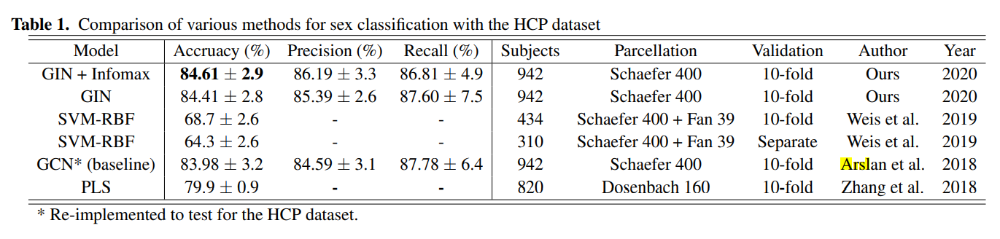
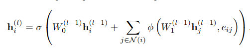
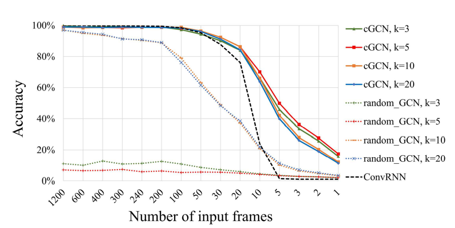
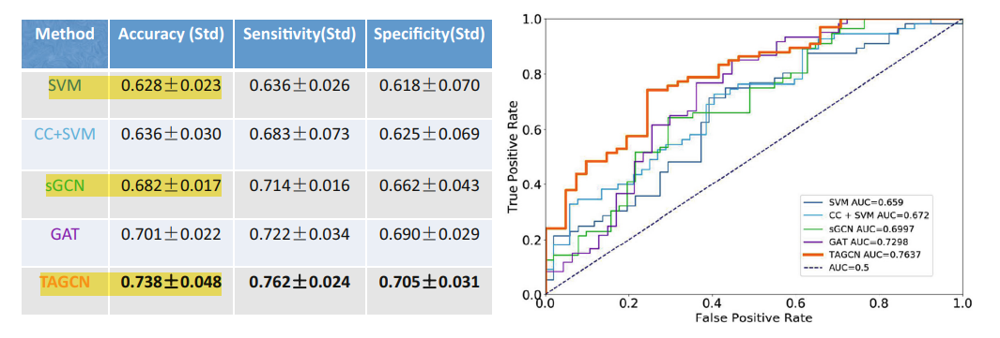
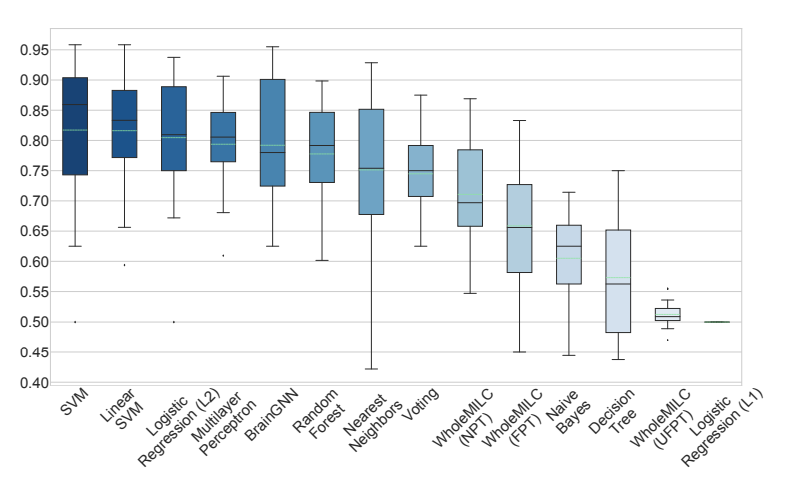
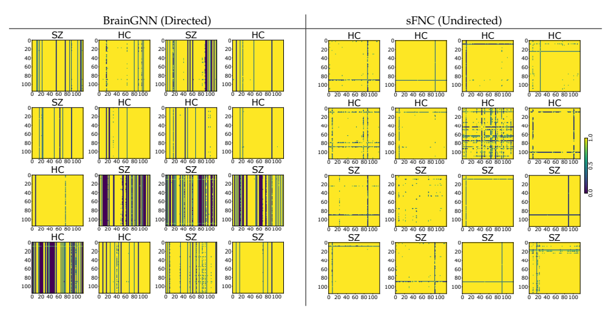

# GNN + FC papers

Collections of papers that use some GNN method on functional connectivity matrices (rs-fMRI) for prediction tasks.

## 1. Understanding Graph Isomorphism Network for rs-fMRI Functional Connectivity Analysis

- **Summary: Use GIN network to predict sex from rs-fMRI FC matrices.**

- Published: May, 2020 at Frontiers

- Authors: Korea Advanced Institute of Science and Technology

- Method: Graph Isomorphism Network (GIN)
  - They also show saliency maps using Grad-CAM.

- Task: Sex Classification

- Data: Human Connectome Project (HCP)
  - 942 scans
  - 0 / 1 label
  - 400 parcels

- Graph:
  - undirected, unweighted
  - edges: top-M percentile of Pearson correlation coefficient
  - vertex: one-hot vector of 400 parcels (=> no BOLD signal)

- Model:
  - 5 GIN layers
  - After each BatchNorm and ReLU
  - After last 0.5 dropout
  - Concatenate output after each GIN
    - not the first, as that's just embedding of the same one-hot vectors
    - sum readout

- Training:
  - Loss: Cross-entropy + lambda * Deep Graph Infomax
  - Optimizer: Adam
  - Epochs: 150
  - Batch size: ?
  - Learning Rate: 0.01 with 0.8 decay every 5 epochs
  - Regime: 10 fold CV

- Results:
  - Sparsity: M = 30 %
  - Hidden size: 64 units
  - Lambda: 0.05
  - **One-hot features beat both mean BOLD signal and Parcel coordinates by ~ 15 %**
  - 

## 2. BrainGNN: Interpretable Brain Graph Neural Network for fMRI Analysis

- **Summary: They implement their own GNN layer, as well as pooling and loss. The purpose is to have several kernels over the node as the brain parcel are not translation invariant across patients.**

- Published: Sep, 2021 at Medical Image Analysis

- Authors: Yale, (one also from Facebook AI)

- Method: Their own Ra-GNN (ROI aware)
  - They also create their own pooling and loss

- Task: Autism Classification (0/1) + 7 task classification

- Reasoning:
  - Currently methods are 2 stage
    - Parcelation stage = ROI creation = reduction of dimensionality (*also noise*)
    - Modelling stage = model based on ROI features
    - => Errors from first stage induce further errors on second stage
  - Node kernels
    - => But brain graphs are not translation invariant
    - => Each node is uniquely identifiable
  - So we:
    - Explore both individual and group level differences
    - Do some extra node clustering

- Data:
  - Human Connectome Project (HCP)
    - 506 scans
    - 7 task classification
    - 268 parcels
  - Autism spectral disorder
    - 115 scans
    - 72 ASD + 43 controls
    - 84 parcels
    - augment 30 times (*how?*) to up-sample

- Graph:
  - ASD:
    - edges: top-10 % positive **partial correlations**
    - vertex: 7 handcrafted + 84 **Pearson correlations**
      - node degree, mean + std of fMRI time series, GLM coefficients (biological motion matrix, scramble motion matrix, ...)
  - HCP:
    - weighted, undirected graph
    - vertex: 268 Pearson correlations + node degree, mean and std of fMRI series
    - edges: top-10 % positive partial correlation

- Model:
  - Ra-GNN
    - 
  - Node pooling using pruning (not grouping)
  - **Just read the paper details if necessary!**
  - 2 Convs + 2 Pooling (0.5 ratio)

- Training:
  - Loss: Custom
  - Optimizer: Adam
  - Epochs: ? (*one shown graph has 100 epochs, so maybe?*)
  - Batch size: 400 for ASD, 200 for HCP
  - Learning Rate: 0.001 with 0.5 decay every 20 epochs
  - Weight decay: 0.005
  - Regime: 5 fold CV (subjects don't cross folds)

- Results:
  - 

## 3. Graph convolutional network for fMRI analysis based on connectivity neighborhood

- **Summary: Use kNN graph frame-by-frame, do temporal averaging and softmax prediction.**

- Published: Feb, 2021 at Network Neuroscience

- Authors: University of California

- Method: EdgeConv

- Task: Autism prediction + Identification

- Data:
  - HCP:
    - 100 subjects each 4 sessions
    - 236 parcels
    - Identification task
  - ASD
    - 1057 subjects
    - 200 parcels

- Graph:
  - one graph per time step and person
  - kNN graph created from average correlation from full training dataset (across time, subjects)
  - edges: nothing
  - nodes: single BOLD value at the specific time frame

- Model:
  - 5 **EdgeConv** layers
  - Concatenate output after each layer
  - MLP with ReLU in EdgeConv
  - Temporal average pooling layer
  - Softmax

- Training:
  - Loss: ? (*Probably CE*)
  - Optimizer: Adam
  - Epochs: ?
  - Batch size: ?
  - Learning Rate: decayed when validation stopped improving, min 1e-6
  - Regularization: L2
  - HCP:
    - 2 sessions for training and validation (1 subject had 2 sessions split into 12 samples)
    - 2 sessions for testing
  - ASD:
    - 10 fold CV or Leave-One-Site-Out

- Results:
  - Test of random graphs instead of kNN
    - 
  - Best k = 5
  - They say they are better than one DNN model, but there are no other comparisons (not even baselines)

## 4. Temporal-Adaptive Graph Convolutional Network for Automated Identification of Major Depressive Disorder Using Resting-State fMRI

- **Summary: They learn FC graphs for time windows and then do learning across time dimension.**

- Published: Sep, 2020 at Machine Learning in Medical Imaging

- Authors: Chinese Academy of Sciences

- Method: overlapping time windows - Temporal Adaptive GCN

- Task: Major depressive disorder - binary classification

- Reasoning:
  - Don't presume that FC is temporarily stationary across measurement

- Data:
  - 533 subjects (282 + 251 controls)
    - one part of http://rfmri.org/REST-meta-MDD dataset (the biggest site)
    - *Why not use all data?*, *Did multi-site study not produce good results?*
  - 112 ROIs
  - 232 time points

- Graph:
  - Adaptive Graph Convolutional Layer
    - 3 adjacency matrices
      - kNN graph within window across all samples via Pearson correlation
      - learnable adjacency matrix
      - embedding matrix via 1x1 convolution

- Model:
  - 25 point windows, slide 10 points -> 10 blocks / subject
  - First part is the Adaptive Graph Convolutional Layer => across subjects
  - Second part is Temporal Convolutional Layer => across time
    - nromal 3x1 convolution

- Training:
  - Loss: ? (*Probably CE*)
  - Optimizer: Adam
  - Epochs: 200
  - Learning Rate: 0.001
  - Batch size: 5
  - Regime: 5 fold CV

- Results:
  - GAT, sGCN: each with 3 convs + fully connected
    - kNN graph across all samples
    - leaky ReLU - 0.2
  - SVM, ClusteringCoefficients SVM
  - 
  - TAGCN > GAT > sGCN > SVMs
  - Graphs are good!
  - Group level topology is too rigid -> need for individualization
  - Temporal dimension helps!

## 5. A Deep Learning Model for Data-Driven Discovery of Functional Connectivity

TODO: Write summary
- **Summary: **

- Published: Feb, 2021 at MDPI Algorithms
  - Also as [ICLR 2021 Workshop GTRL poster](https://openreview.net/forum?id=v7Bct24zeft)

- Authors: Georgia State University

- Method: BrainGNN (*#2, people should be more original when naming*)
  - GNN is GatedGraphConv

- Task: Schizophrenia prediction

- Reasoning:
  - FC graphs are constructed manually, same for the matrices => learn it instead
  - produce not only good classification results, but also identify bio-markers
  - Static ROIs are too stringent, ignore inter-subject ROI variations, especially due to the medical condition

- Data: FBIRN dataset
  - 311 subjects
  - 116 parcels
  - 160 time frames

- Graph:
  - complete directed graph
  - edges: weights from self-attention module
  - nodes: region embeddings after 1d CNN and then self-attention

- Model:
  - 1D CNN
    - Handles temporal dimension
    - Filter: (4,4,3,1), Stide: (2,1,2,1), Channels: (32,64,64,10), ReLU
    - final fully connected to dimension 64
  - Self-Attention
    - key, query, value dense layers, each of dim 24
    - region i:
      - weight_i,j = dot product between query_i and key_j,
      - weights softmaxed across j
      - region_i = sum over j for value_j * weight_ij
  - GNN: GatedGraphConv (num_steps = 2)
    - 3 layers, top-k pooling (20 %), 3 layers
    - 3 readouts: max, average, attention => concatenate
    - 2 dense layers: 32, then 2

- Training:
  - Loss: Cross Entropy
  - Optimizer: Adam
  - Epochs: Early stopping (patience 15)
  - Learning Rate: reduce on plateau (patience 10), starting at ?, reduce how ?
  - Batch size: ?
  - Regime:
    - 215 + 80 + 16 as test
    - 19 fold CV, each fold 10 times = 190 folds
    - in each fold are 100 patients, 100 controls
    - *the reported results don't make it obvious how are val / test sets used*

- Results:
  - 
  - Statistically significant difference between patients and controls
    - Patients have much sparser matrices
    - Not obtained via pearson correlation (here it is the attention module)
    - *I would not be so sure, when looking at the matrices...*
    - 
